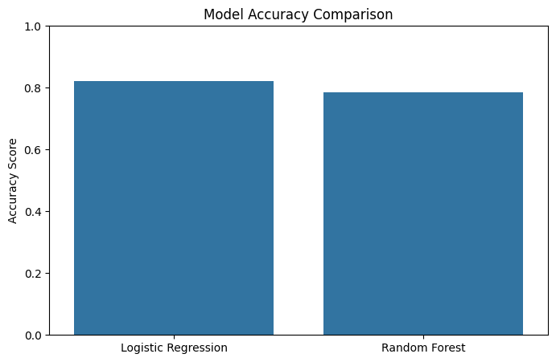
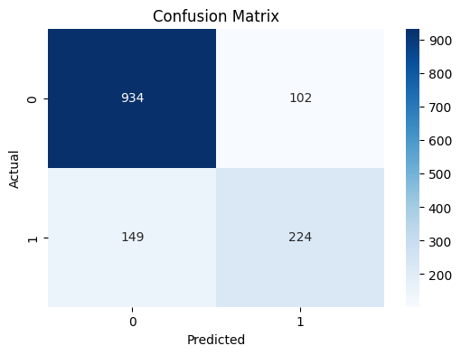
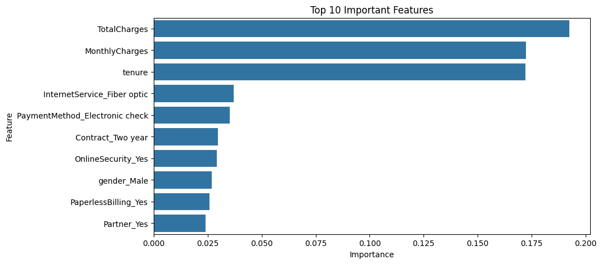

# Customer Churn Prediction

## Overview
This project focuses on predicting customer churn using machine learning techniques on telecom customer data. The objective is to identify customers who are likely to discontinue the service and help businesses improve customer retention strategies through predictive analytics.

---

## Features
- Data Cleaning & Preprocessing
- Exploratory Data Analysis (EDA)
- Logistic Regression Model
- Random Forest Classifier
- Model Accuracy Comparison
- Confusion Matrix Visualization
- Feature Importance Analysis
- Business Insight Generation

---

## Technologies Used
- Python
- Pandas
- NumPy
- Matplotlib
- Seaborn
- Scikit-learn
- Jupyter Notebook
- Git & GitHub

---

## Dataset
The dataset used in this project is the **Telco Customer Churn Dataset** from Kaggle.

Dataset includes:
- Customer demographics
- Subscription details
- Payment methods
- Tenure information
- Churn status

---

## Machine Learning Workflow

### 1. Data Preprocessing
- Handled missing values
- Converted categorical features into numerical format
- Feature engineering using one-hot encoding

### 2. Exploratory Data Analysis
Performed analysis to identify:
- Churn distribution
- Contract type impact
- Gender-based churn patterns
- Customer behavior insights

### 3. Model Building
Implemented:
- Logistic Regression
- Random Forest Classifier

### 4. Model Evaluation
Evaluated models using:
- Accuracy Score
- ROC-AUC Score
- Confusion Matrix
- Feature Importance

---

## Results

| Model | Accuracy |
|-------|----------|
| Logistic Regression | ~82% |
| Random Forest | ~78% |

---

## Visualizations

### Model Accuracy Comparison


---

### Confusion Matrix


---

### Top 10 Important Features


---

## Key Insights
- Customers with month-to-month contracts showed higher churn probability.
- Tenure and monthly charges were among the most important churn indicators.
- Customers using fiber optic internet services had higher churn rates.
- Long-term contracts significantly reduced churn.

---

## Project Structure

```text
customer-churn-prediction/
│
├── data/
├── images/
├── models/
├── notebooks/
│   └── churn_analysis.ipynb
├── src/
├── app.py
├── requirements.txt
├── README.md
└── LICENSE
```

---

## Installation & Setup

### Clone Repository
```bash
git clone https://github.com/MYSiddique2005/customer-churn-prediction.git
```

### Navigate to Project Folder
```bash
cd customer-churn-prediction
```

### Install Dependencies
```bash
pip install -r requirements.txt
```

### Run Jupyter Notebook
```bash
jupyter notebook
```

---

## Future Improvements
- Deploy using Streamlit
- Hyperparameter tuning
- Cross-validation
- Advanced ensemble models
- Real-time churn prediction dashboard

---
## Streamlit Web Application

The project also includes an interactive Streamlit web application for real-time customer churn prediction.

## Live Demo

Try the deployed Streamlit application here:

https://customer-churn-prediction-my-2005.streamlit.app/


## Author
**MOHAMMAD YASIN SIDDIQUE**

GitHub: https://github.com/MYSiddique2005